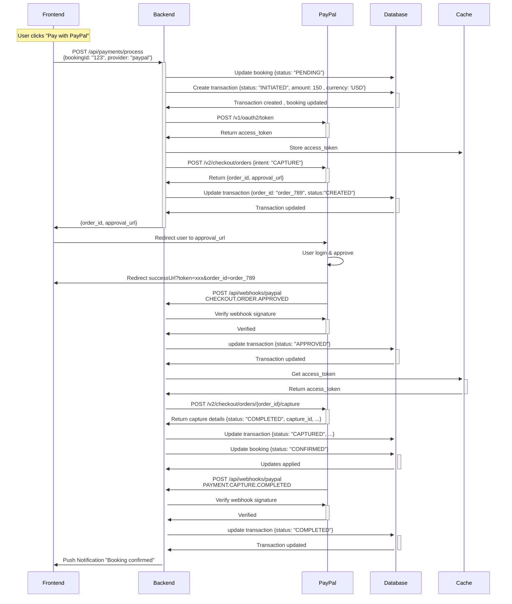

# **Payment Integration with PayPal - Documentation**

This document describes the integration of **PayPal payment** in the booking platform for hotel and flight reservations. It explains how payments are processed, tracked, and recorded using the **Strategy design pattern** to support multiple providers in the future.

The documentation includes:

* Overview of payment flows
* Detailed use case scenarios

## **Table of Contents**

1. [Overview](#overview)
2. [Use Case Flows](#use-case-flows)

   * [Actors](#actors)
   * [Payment Flow Scenarios](#payment-flow-scenarios)

     * [1. Payment Completed Successfully](#1-payment-completed-successfully)
     * [2. Payment Failed](#2-payment-failed)
     * [3. Payment Authorized but Not Captured](#3-payment-authorized-but-not-captured)
     * [4. Refund Flow](#4-refund-flow)
     * [5. User Abandons Payment](#5-user-abandons-payment)

---

## **Overview**

The payment integration supports:

* PayPal payment flow (`authorize`, `capture`, `refund`)
* Transaction tracking for each booking
* Webhook handling for real-time payment updates
* Ability to extend to other payment providers

**Key concepts:**

* **Transaction**: Each payment attempt linked to a booking
* **Booking**: Represents hotel/flight reservation
* **Webhook**: Real-time notification from PayPal for  `payment`, `capture`, `refund` events

---

## **Use Case Flows**

### **Actors**

* **Frontend (User Interface)**

  * Displays booking and payment options
  * Initiates payment requests to the backend
  * Redirects the user to PayPal for approval
  * Shows `success`, `failure`, or `cancellation` messages after payment

* **Backend (PaymentController, PaymentService, StrategyFactory, PaymentProvider)**

  * Handles all API requests from the frontend
  * Creates and updates booking records
  * Manages payment transactions
  * Selects the correct payment provider strategy (e.g., PayPal)
  * Calls external APIs (PayPal) and processes webhooks

* **PayPal (External Payment Gateway)**

  * Provides approval UI for the customer
  * Handles authentication and payment authorization/capture
  * Sends webhooks for `order`, `capture`, `authorization`, and `refund` events

* **Database (Persistence Layer)**

  * Stores booking records with current status (`PENDING`, `CONFIRMED`, `COMPLETED`, `CANCELLED`)
  * Stores payment transactions and their lifecycle states (`INITIATED`, `CREATED`, `APPROVED`, `PENDING`, `AUTHORIZED`, `CAPTURED`, `COMPLETED`, `FAILED`, `CANCELLED`, `REFUNDED`, `PARTIALLY_REFUNDED`, `EXPIRED`)
  * Stores refund requests and results
  * Ensures consistency between booking lifecycle and payment lifecycle.

* **Cache Layer (Redis)**

  * Cache access tokens & expiry for PayPal API calls.

### **Payment Flow Scenarios :**

```mermaid
 ---
config:
  theme: base
---
flowchart TB
    A@{ label: "User clicks 'Pay with PayPal'" } --> B["Frontend calls POST /payments/process"]
    B --> C["Backend creates booking: PENDING"]
    C --> D["DB: Save transaction status=PENDING"]
    D --> BA["Backend requests PayPal OAuth Token"]
    BA --> BB["PayPal returns access_token"]
    BB --> E["Backend calls PayPal POST /v2/checkout/orders with access_token"]
    E --> F["PayPal returns order_id + approval_url"]
    F --> G["DB: Update transaction with order_id, approval_url<br>&amp; status=CREATED"]
    G --> H["Frontend redirects User to PayPal UI<br>by (approval_url)"]
    H --> I{"User Action?"}
    I -- Approve --> O{"Payment Intent?"}
    I -- Abandon/Timeout --> L1["DB: Update transaction=ABANDONED"]
    L1 --> M1["DB: Booking status=PAYMENT_TIMEOUT"]
    M1 --> N1["Notify User: Payment not completed"]
    O -- CAPTURE --> PC["Frontend returns to successUrl (Processing screen)"]
    PC --> PFE["PayPal sends 'CHECKOUT.ORDER.APPROVED' webhook"]
    PFE --> PFEO["Backend verifies webhook signature"]
    PFEO --> PFEA["DB: Update transaction=APPROVED"]
    PFEA --> PD["Backend calls POST /v2/checkout/orders/{order_id}/capture"]
    PD --> PE{"Capture Result?"}
    PE -- Success --> PF["DB: Transaction=CAPTURED<br>Booking=CONFIRMED"]
    PE -- Failed --> PG["DB: Transaction=FAILED<br>Booking=CANCELLED"]
    PF --> PWH["PayPal also sends 'PAYMENT.CAPTURE.COMPLETED' webhook"]
    PWH --> PV["Backend verifies webhook signature"]
    PV --> PWF@{ label: "<span style=\"background-color:\">DB: Transaction=COMPLETED</span><br style=\"--tw-scale-x:\"><span style=\"background-color:\">Booking=CONFIRMED</span>" }
    PWF --> U["Notify User: Booking Confirmed"]
    PG --> V["Notify User: Payment Failed"]
    O -- AUTHORIZE --> PC2["Frontend returns to successUrl (Processing screen)"]
    PC2 --> QA["PayPal sends 'CHECKOUT.ORDER.APPROVED' webhook"]
    QA --> QA1["Backend verifies webhook signature"]
    QA1 --> QB["Backend calls POST /v2/checkout/orders/{order_id}/authorize"]
    QB --> J@{ label: "Payment amount held/reserved on user`s account" }
    J --> Q["PayPal sends 'PAYMENT.AUTHORIZATION.CREATED' webhook"]
    Q --> QV["Backend verifies Authorization Webhook Signature"]
    QV --> W["DB: Transaction=AUTHORIZED<br>Booking=CONFIRMED"]
    W --> X["Notify User: Booking Confirmed"]
    X --> Y{"Merchant Captures Later?"}
    Y -- Yes --> Z["Backend calls PayPal POST /v2/payments/authorizations/{id}/capture"]
    Z --> Z1["PayPal sends 'PAYMENT.AUTHORIZATION.CAPTURED' webhook"]
    Z1 --> Z2["Backend verifies Authorization Capture Webhook Signature"]
    Z2 --> ZV["DB: Transaction=COMPLETED<br>Booking=CONFIRMED"]
    ZV --> AC["Notify User: Booking Confirmed"]
    Y -- No --> AA["PayPal sends 'PAYMENT.AUTHORIZATION.VOIDED' webhook"]
    AA --> AAV["Backend verifies Expired Webhook Signature"]
    AAV --> AD["DB: Transaction=EXPIRED<br>Booking=CANCELLED"]
    AD --> AE["Notify User: Booking Cancelled"]
    U --> AF{"User Requests Refund?"}
    AC --> AF
    AF -- Yes --> AG["Backend calls PayPal Refund API <br> POST /v2/payments/captures/{capture_id}/refund"]
    AG --> AH["DB: Create Refund Record=PENDING"]
    AH --> AI["PayPal triggers Refund Webhook"]
    AI --> AIV["Backend verifies Refund Webhook Signature"]
    AIV --> AJ["DB: Refund=COMPLETED<br>Transaction=PARTIALLY_REFUNDED or REFUNDED<br>Booking=CANCELLED"]
    AJ --> AK["Notify User: Booking Cancelled"]
    AF -- No --> AL["End of Payment Cycle"]

    PWF@{ shape: rect}
    J@{ shape: rect}
    style A fill:#FFCDD2
    style I fill:#FFE0B2
    style O fill:#FFE0B2
    style N1 fill:#FFCDD2
    style PE fill:#FFE0B2
    style V fill:#FFCDD2
    style Y fill:#FFE0B2
    style AE fill:#FFCDD2
    style AF fill:#FFE0B2
    style AK fill:#FFCDD2
    style AL fill:#FFCDD2
```

### **1. Payment Completed Successfully**

**Goal:** To seamlessly finalize a payment via PayPal, confirm the funds have been captured, and update the system to reflect the confirmed booking.

**Precondition:** A user has selected a service, completed the booking form, and has chosen PayPal as their payment method.

**Detailed Flow:**

1. The user clicks the **“Pay with PayPal”** button on the checkout page.
2. The frontend application sends a request to the backend API endpoint `POST /api/payments/process`, containing the (`bookingId`, `bookingType`, `amount`, `currency`, `customerId`, `provider`, `paymentMethodId`).
3. The backend server updates the **Booking** status to `PENDING` and creates a new **Transaction** record with a status of `INITIATED`.
4. The backend authenticates with PayPal by calling `POST /v1/oauth2/token` using the merchant's Client ID and Secret to obtain an `access_token`.
5. The backend stores the `access_token` in Redis.
6. Using this `access_token` , the backend calls the PayPal `POST /v2/checkout/orders` API with `intent: "CAPTURE"`, including `amount`, `currency`, and `redirect_urls`.
7. PayPal responds with a `201 Created` status, a PayPal `order_id`, and an `approval_url`.
8. The backend saves the `order_id` and `approval_url` to the Transaction record and updates the status to `CREATED`
9. The backend responds to the frontend with the `order_id` and `approval_url`, and the frontend redirects the user's browser to `approval_url`.
10. The user logs into PayPal and confirms the payment on PayPal's page.
11. Upon approval, PayPal redirects the user's browser back to the configured `returnUrl` (e.g., `https://example.com/payment/success`) along with the `order_id`.
12.**In parallel**, The PayPal sends an asynchronous `CHECKOUT.ORDER.APPROVED` webhook event to the backend’s webhook listener (`POST /api/webhooks/paypal`).
13. The backend receives the webhook, verifies its cryptographic signature to confirm it’s from PayPal, and updates the **Transaction** status to `APPROVED`.
14. The backend, using the stored `order_id` (from the Transaction record) and `access token` (from Redis), calls PayPal’s `POST /v2/checkout/orders/{order_id}/capture` endpoint to finalize the payment.
15. PayPal responds with a `201 Created` and the capture details (including `capture_id`, `status`, and `amount`).
16. The backend updates the **Transaction** status to `CAPTURED` and the **Booking** status to `CONFIRMED`.
17. **In parallel**, PayPal also sends an asynchronous `PAYMENT.CAPTURE.COMPLETED` webhook event to the backend’s webhook listener (`POST /api/webhooks/paypal`).
18. The backend receives the webhook, verifies its cryptographic signature to confirm it’s from PayPal, and updates the **Transaction** status to `COMPLETED`.
19. The frontend, now on the `returnUrl`, polls the backend or receives a push notification. Upon detecting the `CONFIRMED` status for the Booking & `COMPLETED` status for the Transaction, it displays a booking confirmation page.

**Postcondition:** The Transaction is `COMPLETED` and the Booking is `CONFIRMED`.

**Sequence diagram:**

---
