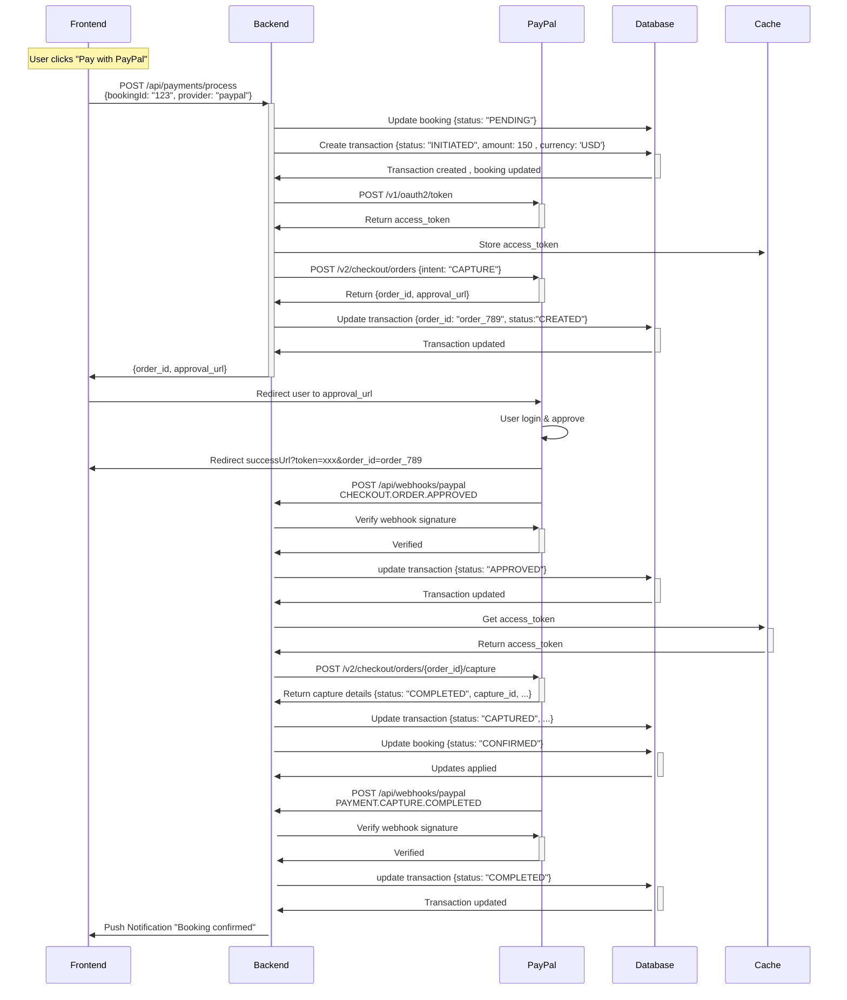
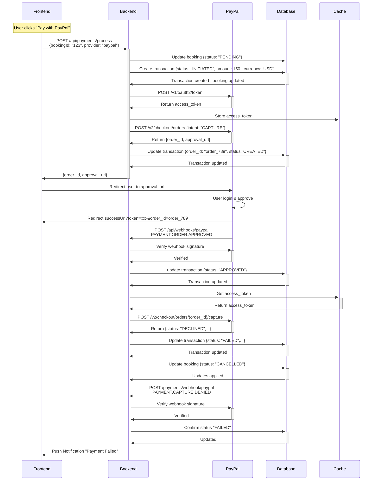
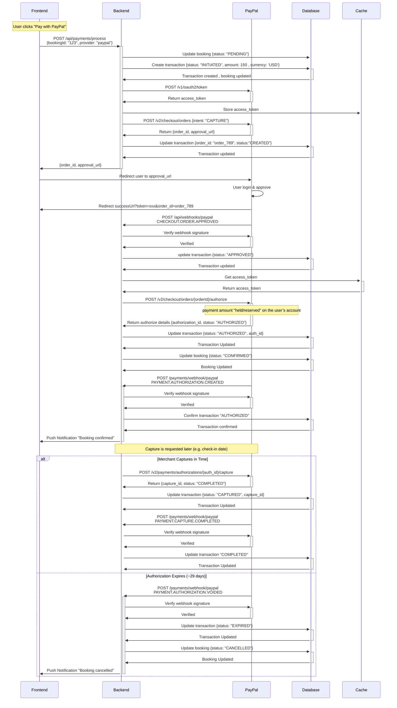
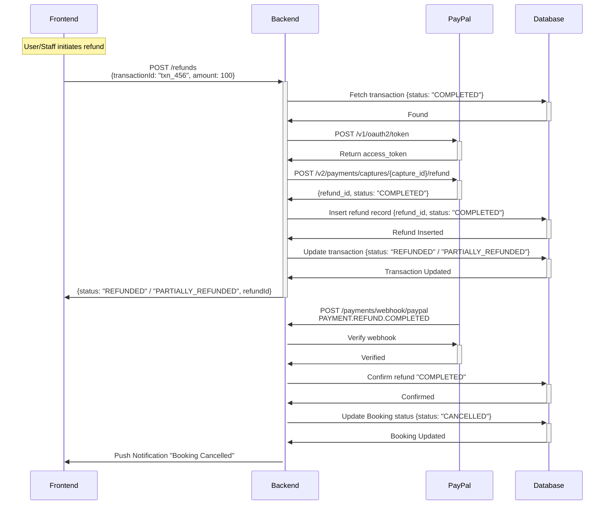
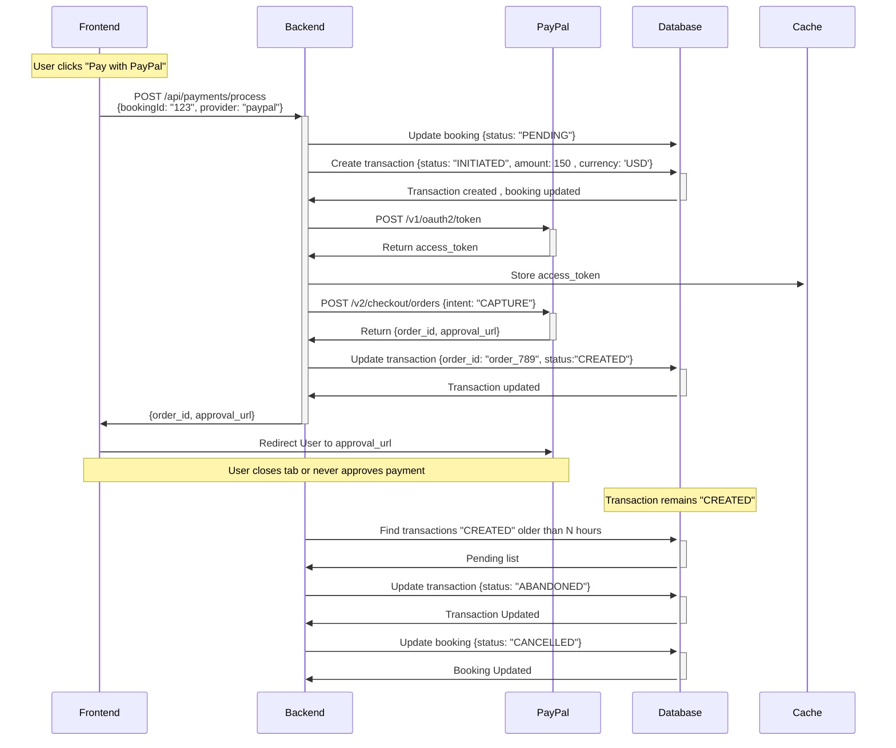

# **Payment Integration with PayPal - Documentation**

This document describes the integration of **PayPal payment** in the booking platform for hotel and flight reservations. It explains how payments are processed, tracked, and recorded using the **Strategy design pattern** to support multiple providers in the future.

The documentation includes:

* Overview of payment flows
* Detailed use case scenarios

## **Table of Contents**

1. [Overview](#overview)
2. [Use Case Flows](#use-case-flows)

   * [Actors](#actors)
   * [Payment Flow Scenarios](#payment-flow-scenarios)

     * [1. Payment Completed Successfully](#1-payment-completed-successfully)
     * [2. Payment Failed](#2-payment-failed)
     * [3. Payment Authorized but Not Captured](#3-payment-authorized-but-not-captured)
     * [4. Refund Flow](#4-refund-flow)
     * [5. User Abandons Payment](#5-user-abandons-payment)

---

## **Overview**

The payment integration supports:

* PayPal payment flow (`authorize`, `capture`, `refund`)
* Transaction tracking for each booking
* Webhook handling for real-time payment updates
* Ability to extend to other payment providers

**Key concepts:**

* **Transaction**: Each payment attempt linked to a booking
* **Booking**: Represents hotel/flight reservation
* **Webhook**: Real-time notification from PayPal for  `payment`, `capture`, `refund` events

---

## **Use Case Flows**

### **Actors**

* **Frontend (User Interface)**

  * Displays booking and payment options
  * Initiates payment requests to the backend
  * Redirects the user to PayPal for approval
  * Shows `success`, `failure`, or `cancellation` messages after payment

* **Backend (PaymentController, PaymentService, StrategyFactory, PaymentProvider)**

  * Handles all API requests from the frontend
  * Creates and updates booking records
  * Manages payment transactions
  * Selects the correct payment provider strategy (e.g., PayPal)
  * Calls external APIs (PayPal) and processes webhooks

* **PayPal (External Payment Gateway)**

  * Provides approval UI for the customer
  * Handles authentication and payment authorization/capture
  * Sends webhooks for `order`, `capture`, `authorization`, and `refund` events

* **Database (Persistence Layer)**

  * Stores booking records with current status (`PENDING`, `CONFIRMED`, `COMPLETED`, `CANCELLED`)
  * Stores payment transactions and their lifecycle states (`INITIATED`, `CREATED`, `APPROVED`, `PENDING`, `AUTHORIZED`, `CAPTURED`, `COMPLETED`, `FAILED`, `CANCELLED`, `REFUNDED`, `PARTIALLY_REFUNDED`, `EXPIRED`,`ABANDONED`)
  * Stores refund requests and results
  * Ensures consistency between booking lifecycle and payment lifecycle.

* **Cache Layer (Redis)**

  * Cache access tokens & expiry for PayPal API calls.

### **Payment Flow Scenarios :**

```mermaid
 ---
config:
  theme: base
---
flowchart TB
    A@{ label: "User clicks 'Pay with PayPal'" } --> B["Frontend calls POST /payments/process"]
    B --> C["Backend creates booking: PENDING"]
    C --> D["DB: Save transaction status=PENDING"]
    D --> BA["Backend requests PayPal OAuth Token"]
    BA --> BB["PayPal returns access_token"]
    BB --> E["Backend calls PayPal POST /v2/checkout/orders with access_token"]
    E --> F["PayPal returns order_id + approval_url"]
    F --> G["DB: Update transaction with order_id, approval_url<br>&amp; status=CREATED"]
    G --> H["Frontend redirects User to PayPal UI<br>by (approval_url)"]
    H --> I{"User Action?"}
    I -- Approve --> O{"Payment Intent?"}
    I -- Abandon/Timeout --> L1["DB: Update transaction=ABANDONED"]
    L1 --> M1["DB: Booking status=PAYMENT_TIMEOUT"]
    M1 --> N1["Notify User: Payment not completed"]
    O -- CAPTURE --> PC["Frontend returns to successUrl (Processing screen)"]
    PC --> PFE["PayPal sends 'CHECKOUT.ORDER.APPROVED' webhook"]
    PFE --> PFEO["Backend verifies webhook signature"]
    PFEO --> PFEA["DB: Update transaction=APPROVED"]
    PFEA --> PD["Backend calls POST /v2/checkout/orders/{order_id}/capture"]
    PD --> PE{"Capture Result?"}
    PE -- Success --> PF["DB: Transaction=CAPTURED<br>Booking=CONFIRMED"]
    PE -- Failed --> PG["DB: Transaction=FAILED<br>Booking=CANCELLED"]
    PF --> PWH["PayPal also sends 'PAYMENT.CAPTURE.COMPLETED' webhook"]
    PWH --> PV["Backend verifies webhook signature"]
    PV --> PWF@{ label: "<span style=\"background-color:\">DB: Transaction=COMPLETED</span><br style=\"--tw-scale-x:\"><span style=\"background-color:\">Booking=CONFIRMED</span>" }
    PWF --> U["Notify User: Booking Confirmed"]
    PG --> V["Notify User: Payment Failed"]
    O -- AUTHORIZE --> PC2["Frontend returns to successUrl (Processing screen)"]
    PC2 --> QA["PayPal sends 'CHECKOUT.ORDER.APPROVED' webhook"]
    QA --> QA1["Backend verifies webhook signature"]
    QA1 --> QB["Backend calls POST /v2/checkout/orders/{order_id}/authorize"]
    QB --> J@{ label: "Payment amount held/reserved on user`s account" }
    J --> Q["PayPal sends 'PAYMENT.AUTHORIZATION.CREATED' webhook"]
    Q --> QV["Backend verifies Authorization Webhook Signature"]
    QV --> W["DB: Transaction=AUTHORIZED<br>Booking=CONFIRMED"]
    W --> X["Notify User: Booking Confirmed"]
    X --> Y{"Merchant Captures Later?"}
    Y -- Yes --> Z["Backend calls PayPal POST /v2/payments/authorizations/{id}/capture"]
    Z --> Z1["PayPal sends 'PAYMENT.AUTHORIZATION.CAPTURED' webhook"]
    Z1 --> Z2["Backend verifies Authorization Capture Webhook Signature"]
    Z2 --> ZV["DB: Transaction=COMPLETED<br>Booking=CONFIRMED"]
    ZV --> AC["Notify User: Booking Confirmed"]
    Y -- No --> AA["PayPal sends 'PAYMENT.AUTHORIZATION.VOIDED' webhook"]
    AA --> AAV["Backend verifies Expired Webhook Signature"]
    AAV --> AD["DB: Transaction=EXPIRED<br>Booking=CANCELLED"]
    AD --> AE["Notify User: Booking Cancelled"]
    U --> AF{"User Requests Refund?"}
    AC --> AF
    AF -- Yes --> AG["Backend calls PayPal Refund API <br> POST /v2/payments/captures/{capture_id}/refund"]
    AG --> AH["DB: Create Refund Record=PENDING"]
    AH --> AI["PayPal triggers Refund Webhook"]
    AI --> AIV["Backend verifies Refund Webhook Signature"]
    AIV --> AJ["DB: Refund=COMPLETED<br>Transaction=PARTIALLY_REFUNDED or REFUNDED<br>Booking=CANCELLED"]
    AJ --> AK["Notify User: Booking Cancelled"]
    AF -- No --> AL["End of Payment Cycle"]

    PWF@{ shape: rect}
    J@{ shape: rect}
    style A fill:#FFCDD2
    style I fill:#FFE0B2
    style O fill:#FFE0B2
    style N1 fill:#FFCDD2
    style PE fill:#FFE0B2
    style V fill:#FFCDD2
    style Y fill:#FFE0B2
    style AE fill:#FFCDD2
    style AF fill:#FFE0B2
    style AK fill:#FFCDD2
    style AL fill:#FFCDD2
```

### **1. Payment Completed Successfully**

**Goal:** To seamlessly finalize a payment via PayPal, confirm the funds have been captured, and update the system to reflect the confirmed booking.

**Precondition:** A user has selected a service, completed the booking form, and has chosen PayPal as their payment method.

**Detailed Flow:**

1. The user clicks the **“Pay with PayPal”** button on the checkout page.
2. The frontend application sends a request to the backend API endpoint `POST /api/payments/process`, containing the (`bookingId`, `bookingType`, `amount`, `currency`, `customerId`, `provider`, `paymentMethodId`).
3. The backend server updates the **Booking** status to `PENDING` and creates a new **Transaction** record with a status of `INITIATED`.
4. The backend authenticates with PayPal by calling `POST /v1/oauth2/token` using the merchant's Client ID and Secret to obtain an `access_token`.
5. The backend stores the `access_token` in Redis.
6. Using this `access_token` , the backend calls the PayPal `POST /v2/checkout/orders` API with `intent: "CAPTURE"`, including `amount`, `currency`, and `redirect_urls`.
7. PayPal responds with a `201 Created` status, a PayPal `order_id`, and an `approval_url`.
8. The backend saves the `order_id` and `approval_url` to the Transaction record and updates the status to `CREATED`
9. The backend responds to the frontend with the `order_id` and `approval_url`, and the frontend redirects the user's browser to `approval_url`.
10. The user logs into PayPal and confirms the payment on PayPal's page.
11. Upon approval, PayPal redirects the user's browser back to the configured `returnUrl` (e.g., `https://example.com/payment/success`) along with the `order_id`.
12.**In parallel**, The PayPal sends an asynchronous `CHECKOUT.ORDER.APPROVED` webhook event to the backend’s webhook listener (`POST /api/webhooks/paypal`).
13. The backend receives the webhook, verifies its cryptographic signature to confirm it’s from PayPal, and updates the **Transaction** status to `APPROVED`.
14. The backend, using the stored `order_id` (from the Transaction record) and `access token` (from Redis), calls PayPal’s `POST /v2/checkout/orders/{order_id}/capture` endpoint to finalize the payment.
15. PayPal responds with a `201 Created` and the capture details (including `capture_id`, `status`, and `amount`).
16. The backend updates the **Transaction** status to `CAPTURED` and the **Booking** status to `CONFIRMED`.
17. **In parallel**, PayPal also sends an asynchronous `PAYMENT.CAPTURE.COMPLETED` webhook event to the backend’s webhook listener (`POST /api/webhooks/paypal`).
18. The backend receives the webhook, verifies its cryptographic signature to confirm it’s from PayPal, and updates the **Transaction** status to `COMPLETED`.
19. The frontend, now on the `returnUrl`, polls the backend or receives a push notification. Upon detecting the `CONFIRMED` status for the Booking & `COMPLETED` status for the Transaction, it displays a booking confirmation page.

**Postcondition:** The Transaction is `COMPLETED` and the Booking is `CONFIRMED`.

**Sequence diagram:**

---

### **2. Payment Failed (Declined by PayPal)**

**Goal:** To gracefully handle a payment attempt that is declined by PayPal due to insufficient funds, invalid payment method, or other security reasons.

**Precondition:** The user has initiated a payment flow with a PayPal account or payment method that is invalid or cannot cover the charge.

**Detailed Flow:**

1. The user clicks the **“Pay with PayPal”** button on the checkout page.
2. The frontend application sends a request to the backend API endpoint `POST /api/payments/process`, containing the (`bookingId`, `bookingType`, `amount`, `currency`, `customerId`, `provider`, `paymentMethodId`).
3. The backend server updates the **Booking** status to `PENDING` and creates a new **Transaction** record with a status of `INITIATED`.
4. The backend authenticates with PayPal by calling `POST /v1/oauth2/token` using the merchant's Client ID and Secret to obtain an `access_token`.
5. The backend stores the `access_token` in Redis.
6. Using this `access_token` , the backend calls the PayPal `POST /v2/checkout/orders` API with `intent: "CAPTURE"`, including `amount`, `currency`, and `redirect_urls`.
7. PayPal responds with a `201 Created` status, a PayPal `order_id`, and an `approval_url`.
8. The backend saves the `order_id` and `approval_url` to the Transaction record and updates the status to `CREATED`
9. The backend responds to the frontend with the `order_id` and `approval_url`, and the frontend redirects the user's browser to `approval_url`.
10. The user logs into PayPal and confirms the payment on PayPal's page.
11. Upon approval, PayPal redirects the user's browser back to the configured `returnUrl` (e.g., `https://example.com/payment/success`) along with the `order_id`.
12.**In parallel**, The PayPal sends an asynchronous `CHECKOUT.ORDER.APPROVED` webhook event to the backend’s webhook listener (`POST /api/webhooks/paypal`).
13. The backend receives the webhook, verifies its cryptographic signature to confirm it’s from PayPal, and updates the **Transaction** status to `APPROVED`.
14. The backend, using the stored `order_id` (from the Transaction record) and `access token` (from Redis), calls PayPal’s `POST /v2/checkout/orders/{order_id}/capture` endpoint to finalize the payment.
15. PayPal's systems decline the transaction (e.g., due to insufficient funds).
16. PayPal sends a `PAYMENT.CAPTURE.DENIED` webhook event to the backend's webhook listener.
17. The backend receives the webhook, verifies its cryptographic signature to confirm it’s from PayPal, and updates the **Transaction** status to `FAILED`.
19. The associated **Booking** status is set to `CANCELLED`.
18. The frontend, which may be on a generic pending page, fetches the status and displays a "Payment failed. Please try a different method." error.

**Postcondition:** The Transaction is `FAILED` and the Booking is `CANCELLED`.

**Sequence diagram:**

---

### **3. Payment Authorized but Not Captured (Delayed Capture)**

**Goal:** To authorize a user's funds without immediately capturing them, allowing for capture at a later date while holding the amount on the user’s account.

**Precondition:** The merchant’s business model requires an authorization hold first (e.g., hotel booking).

**Detailed Flow:**

1. The user clicks the **“Pay with PayPal”** button on the checkout page.
2. The frontend application sends a request to the backend API endpoint `POST /api/payments/process`, containing the (`bookingId`, `bookingType`, `amount`, `currency`, `customerId`, `provider`, `paymentMethodId`).
3. The backend server updates the **Booking** status to `PENDING` and creates a new **Transaction** record with a status of `INITIATED`.
4. The backend authenticates with PayPal by calling `POST /v1/oauth2/token` using the merchant's Client ID and Secret to obtain an `access_token`.
5. The backend stores the `access_token` in Redis.
6.  **Critical Difference:** Using this `access_token` , The backend calls `POST /v2/checkout/orders` with `intent: "AUTHORIZE"` including `amount`, `currency`, and `redirect_urls`.
7. PayPal responds with a `201 Created` status, a PayPal `order_id`, and an `approval_url`.
8.  The backend stores this `order_id` and `approval_url` against the Transaction record.
9.  The backend responds to the frontend with the `approval_url`, and the frontend redirects the user's browser to it.
10. The user logs into PayPal and confirms the payment on PayPal's page.
11. Upon approval, PayPal redirects the user's browser back to the configured `returnUrl` (e.g., `https://example.com/payment/success`) along with the `order_id`.
12. **In parallel**, The PayPal sends an asynchronous `CHECKOUT.ORDER.APPROVED` webhook event to the backend’s 
webhook listener (`POST /api/webhooks/paypal`).
13. The backend receives the webhook, verifies its cryptographic signature to confirm it’s from PayPal, and updates the **Transaction** status to `APPROVED`.
14. Backend uses stored `order_id` (from the Transaction record) and `access_token` (from Redis) to call `POST /v2/checkout/orders/{order_id}/authorize`
* At this point, the payment amount is **held/reserved** on the user’s account (funds are not yet captured, but unavailable for other transactions).
* PayPal returns `authorization_id` and status.
15. Backend updates the **Transaction** status to `AUTHORIZED` and **Booking** status to `CONFIRMED`.
16. **In parallel**, The PayPal sends an asynchronous `PAYMENT.AUTHORIZATION.CREATED` webhook event to the backend’s webhook listener (`POST /api/webhooks/paypal`).
17. The backend receives the webhook, verifies its cryptographic signature to confirm it’s from PayPal, reconciles the Transaction and Booking.

18. **Later Capture:** When the merchant decides to capture the funds, backend calls `POST /v2/payments/authorizations/{authorization_id}/capture`

* PayPal captures the held funds and responds with capture details.

19. PayPal sends a `PAYMENT.CAPTURE.COMPLETED` webhook.

* Backend updates **Transaction** to status `COMPLETED`.
* The frontend, now on the `returnUrl`, polls the backend or receives a push notification. Upon detecting the `CONFIRMED` status for the Booking & `COMPLETED` status for the Transaction, it displays a booking confirmation page.

20. **Expiry Handling:** If capture is **not performed within \~29 days**, PayPal voids the authorization and sends a `PAYMENT.AUTHORIZATION.VOIDED` webhook.

* Backend updates **Transaction** status to `EXPIRED` and **Booking** status to `CANCELLED`.
* Backend sends a push notification to the user’s device "Booking cancelled"

**Postcondition:**

* Transaction = `AUTHORIZED`, `COMPLETED`, or `EXPIRED` depending on capture.
* Booking = `CONFIRMED`, or `CANCELLED`.
* Amount may be held in the user’s account until capture or expiry.

**Sequence diagram:**

---

### **4. Refund Flow**

**Goal:** To process a full or partial return of funds to the user after a booking has been paid for and confirmed.

**Precondition:** A booking with a status of `CONFIRMED` and a linked `COMPLETED` transaction exists.

**Detailed Flow:**

1.  A user or admin initiates a refund request via the frontend or dashboard.
2.  The frontend (user, admin, or automated process) calls a backend endpoint such as `POST /api/bookings/{id}/refund`.
3.  The backend validates the request and creates a **Refund** record with a status of `PENDING`, linked to the original transaction.
4.  The backend obtains a fresh PayPal OAuth `access_token`.
5.  The backend calls the PayPal Refund API: `POST /v2/payments/captures/{capture_id}/refund`.
6.  PayPal processes the refund and sends a `PAYMENT.REFUND.COMPLETED` webhook event upon completion.
7.  The backend verifies the webhook and updates the system:
    * The **Refund** record status is updated to `COMPLETED`.
    * The original **Transaction** status is updated to `REFUNDED` or `PARTIALLY_REFUNDED`.
    * The **Booking** status is updated to `CANCELLED`.
8.  The frontend updates to show a confirmation that the refund has been processed & Booking is cancelled.

**Postcondition:** The Transaction is `REFUNDED`, the Booking status is updated to either `CONFIRMED` or `CANCELLED` (depending on the refund scenario), and funds are returned.

**Sequence diagram:**

---

### **5. User Abandons Payment**

**Goal:** To handle incomplete payment flows where the user leaves the PayPal checkout page without taking action.

**Precondition:** A user has initiated a payment but fails to complete it.

**Detailed Flow:**

1.  The user clicks the **“Pay with PayPal”** button on the checkout page.
2.  The frontend application sends a request to the backend API endpoint `POST /api/payments/process`, containing the booking ID.
3.  The backend server updates the **Booking** status to `PENDING` and creates a new **Transaction** record with a status of `INITIATED`.
4.  The backend authenticates with PayPal by calling `POST /v1/oauth2/token` using the merchant's Client ID and Secret to obtain an `access_token`.
5.  Using this token, the backend calls the PayPal `POST /v2/checkout/orders` API with `intent: "CAPTURE"`, including amount, currency, and `redirect_urls`.
6.  PayPal responds with a `201 Created` status, a PayPal `order_id`, and an `approval_url`.
7.  The backend stores this `order_id` and `approval_url` against the Transaction record.
8.  The backend responds to the frontend with the `approval_url`, and the frontend redirects the user's browser to it.
9.  The user **abandons the process** by closing the browser tab, navigating away, or remaining idle. **No further interaction occurs.**
10.  **No webhook is received** from PayPal because the user never approved or denied the payment.
11.  A scheduled **cron job** on the backend runs periodically (e.g., every 30 minutes). This job searches for all Transaction records that have been in a `CREATED` state for longer than the timeout threshold (e.g., >30 minutes).
12. For each matching record, the cron job updates the statuses:
    * The **Transaction** status is set to `ABANDONED`.
    * The associated **Booking** status is set to `CANCELLED`.
13. This action may also release any reserved inventory associated with the booking.
14. If the user returns to the application, the frontend will display a message indicating the payment session timed out.

**Postcondition:** The Transaction is `ABANDONED` and the Booking is `CANCELLED`. System resources are cleaned up.

**Sequence diagram:**

